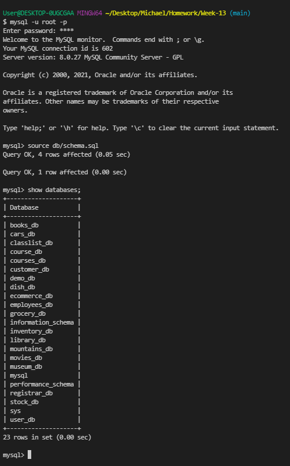
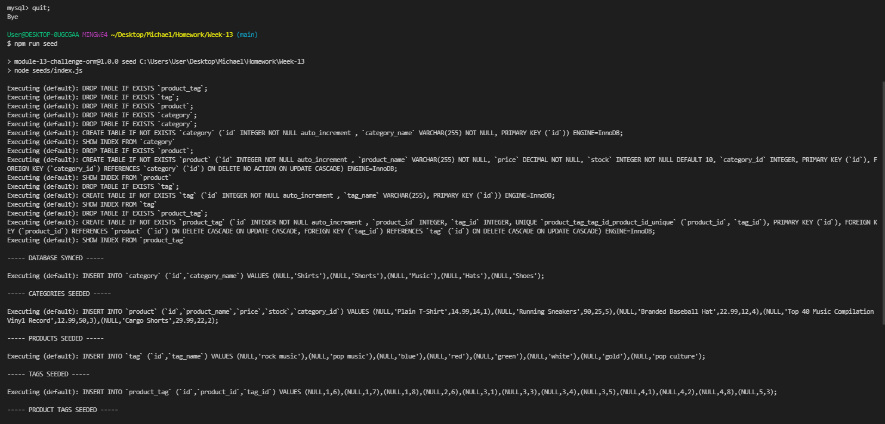
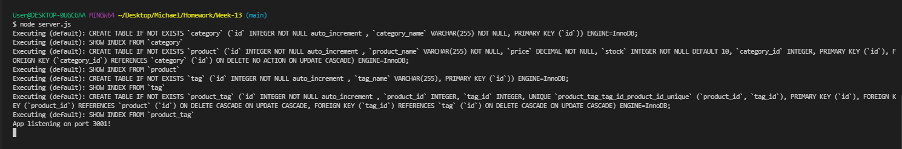
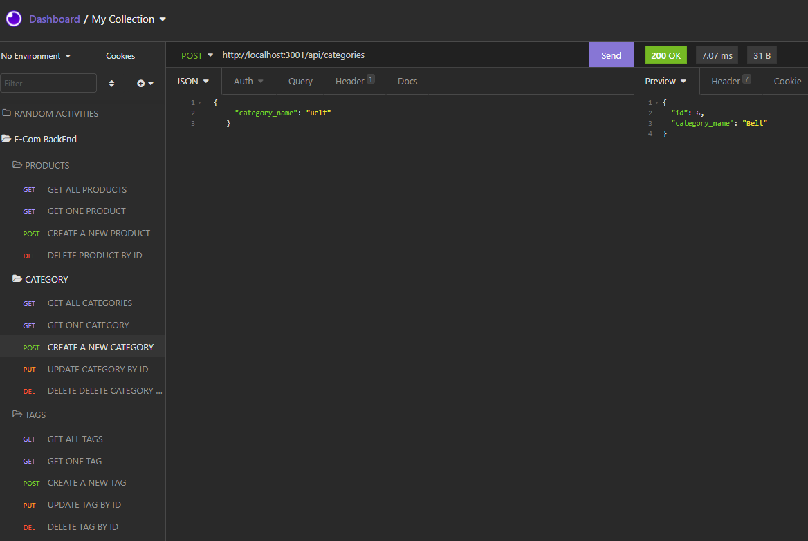

# 13 Object-Relational Mapping (ORM): E-Commerce Back End

## Description

Internet retail, also known as **e-commerce**, is the largest sector of the electronics industry, generating an estimated $29 trillion in 2019. E-commerce platforms like Shopify and WooCommerce provide a suite of services to businesses of all sizes. Due to their prevalence, understanding the fundamental architecture of these platforms will benefit you as a full-stack web developer.

Our task is to build the back end for an e-commerce site by modifying starter code. We will configure a working Express.js API to use Sequelize to interact with a MySQL database.

This is an important activity as it allowed us to implement our sequelize skills, practice and show our understanding of routes (get, post, put, delete), demonstrate our understanding of one to one and one to many relationships and continue our understanding of async functions. 

Overall, it was a great activity and i know have a greater understanding of how different routes work. 

To see a full demonstration of the activity (showing the connectoin files, the schema file, seeding the database and starting the server from the command as well as the routes all working in localhost via insomnia) [CLICK HERE FROM DEMO](https://watch.screencastify.com/v/ehELJiLw2KjN3cLKwbLK) 

## Table of Contents 
- [Installation](#installation)
- [Usage](#usage)
- [Features](#features)
- [Contribute](#contribute)
- [License](#license)

## Installation
Once the user has cloned the project from GitHub there are a few steps they must undertake in order to get the application running.

You’ll need to use the [MySQL2](https://www.npmjs.com/package/mysql2) and [Sequelize](https://www.npmjs.com/package/sequelize) packages to connect your Express.js API to a MySQL database and the [dotenv](https://www.npmjs.com/package/dotenv) package to use environment variables to store sensitive data.

Use the `schema.sql` file in the `db` folder to create your database with MySQL shell commands. Use environment variables to store sensitive data like your MySQL username, password, and database name.

Once the schema has been established, you need to 'seed' the database. 
This is done by running  `npm run seed` to seed data to your database so that you can test your routes.

Once the seeds have been executed create the code needed in `server.js` to sync the Sequelize models to the MySQL database on server start.

## Usage

Once all the dependencies have been installed, in the command line the user can create databases using the schema.sql file and check the database as been created. 

The user can then exit mysql by typing 'quit'. The next important step is to seed the database with data. This is done by tpying npm run seed. 

The final step before moving to insomnia is to activate the server by inputing 'node server.js' Once it displays 'App Listening on port XXXX (in this instance 3001) you know the localhost is ready to run. 

The user is now ready to use insomnia to test all the routes. 

Once in insomnia the user has many options to explore. They can test the routes for all products, categories and tag data. 
They can test the routes for individual products, categories and tags based on their ID's. 
They can create new products, categories and tags. 
They can update products, categories and tags and lastly, they can delete products, categories and tags. 

For example you can create a new cateogry called socks, this category will have the id number of 6. 

The user can then view the new cateogry with all other cateogires by running the GET All Categories route, the user can search the new category individually (using its id), the user can also update the category name or delete the category. 

To see a full demonstation  [click here](https://watch.screencastify.com/v/ehELJiLw2KjN3cLKwbLK) 

## Features
- node.js
- mySQL
- sequelize
- dotenv 
- Javascript
- Insomnia Core

## Contribute
If you would like to contribute to this project please contact me via email at mjhwest89@gmail.com

## License
This project is released under the [MIT LICENSE](https://github.com/mjhwest/E-Commerce-Back-End/blob/main/LICENSE)

